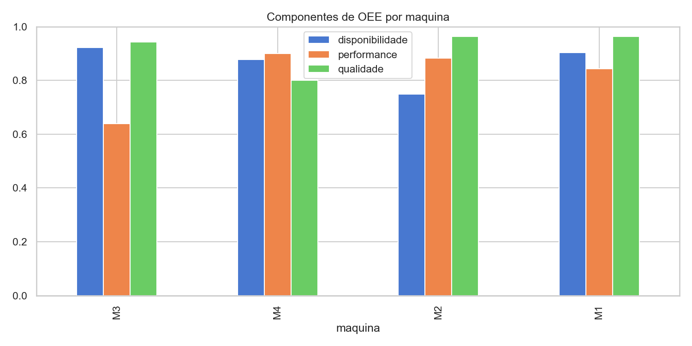

# Relatório Final: Eficiência Operacional e OEE Industrial

Produção simulada de 4 máquinas, 120 dias cada.

## OEE por Máquina

| Máquina | Disponibilidade | Performance | Qualidade | OEE | Gargalo |
|---|---|---|---|---|---|
| M3 | 0,923 | 0,639 | 0,942 | 0,556 | Performance |
| M4 | 0,878 | 0,900 | 0,800 | 0,633 | Qualidade |
| M2 | 0,749 | 0,883 | 0,963 | 0,637 | Disponibilidade |
| M1 | 0,903 | 0,844 | 0,963 | 0,734 | Performance |

## Conclusão

Cada máquina tem um gargalo diferente, decompor o OEE em vez de olhar só o número final mostra exatamente onde investir primeiro: M3 (menor OEE geral) precisa de ajuste de velocidade de ciclo, não de manutenção preventiva de parada.
